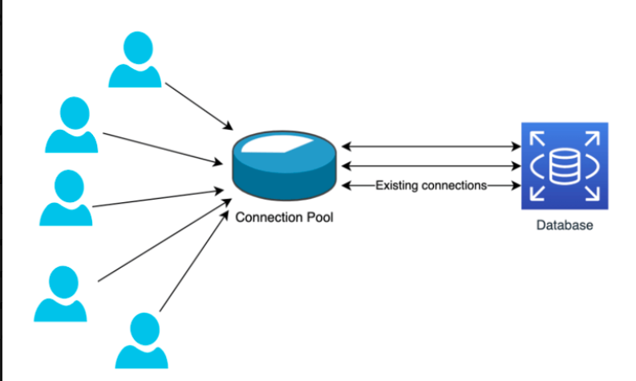

# Intro

This source code relates to the following blog post.

> [Why Database Connection Pooling is Crucial in 30 seconds](https://open.substack.com/pub/hihoay/p/why-database-connection-pooling-is?r=1xbaxi&utm_campaign=post&utm_medium=web&showWelcomeOnShare=true)

Connection pooling boosts performance by reusing database connections instead of creating a new one for every request. Without pooling, each connection setup at the OS level adds overhead—like opening sockets and authenticating—slowing things down. By comparing both scenarios, you’ll see how pooling avoids this repeated cost, making your app faster and more efficient.



# Prerequisites

- Docker and Docker Compose
- [Hey](https://github.com/rakyll/hey) for load testing

# Start docker

```sh
docker-compose up -d db proxysql

docker-compose up -d node-direct node-proxysql
```

Please make sure you are able to connect to two following addresses:

- `http://localhost:3001`: connects direct to MariaDB
- `http://localhost:3002`: connects to MariaDB via Proxysql as connection pooling

# Monitoring

## Proxysql

To continuously monitor active connections, you can use the Linux watch command. For example:

```sh
# SSH to mariadb container
docker-compose exec -it proxysql bash

# install watch
apt-get update && apt install procps

# keep watching statistic of pool
watch -n 1 "mysql -uadmin -padmin -P6032 -e 'SELECT * FROM stats_mysql_connection_pool \G;'"
```

## Mariadb

You can use the built-in MariaDB/MySQL status variable to see the number of active connections

```sh
# SSH to mariadb container
docker-compose exec -it db bash
```

```sh
watch -n 1 "mysql -uuser -ppass -e \"SHOW STATUS LIKE 'Threads_connected';\""

# OR

watch -n 1 "mysql -uuser -ppass -e 'SHOW PROCESSLIST'"
```

# HTTP load generator

Hey is a modern HTTP load generator written in Go. It’s super simple and good for testing how your server handles concurrent requests. Use this tool to test two addresses above and see what differences:

```sh
# for the sever NOT using connection pooling
hey -n 10000 -c 150 http://localhost:3001/

# for the sever using connection pooling
hey -n 10000 -c 150 http://localhost:3002/
```

- `-n 10000`: total number of requests to send

- `-c 150`: number of concurrent workers (i.e., simulates 150 users at once)
